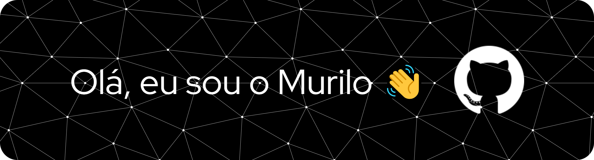

🌠Idioma: 
  <a href="./README.md">PT-BR</a>
  <a href="./README.en.md">ENG</a> /

  

    
    <h3>Tenho 22 anos e atualmente estou estudando desenvolvimento web. 💻🚀</h3>
    
<a href="https://www.formacao.dev/" target="_blank">Eu estudo na Formação DEV da Cod3r</a>

  

  

    <h2>🛠️ Tecnologias Aprendidas</h2>
    <h3>Tecnologias</h3>
    
    
    
    
    
    
     
     
    <h3>Ferramentas</h3>
    
    
    
      
    <h2>📖 Tecnologias que vou aprender em breve</h2>
    
    
    
    
    
    
    <h2>📧 Entre em contato comigo</h2>
    
  

